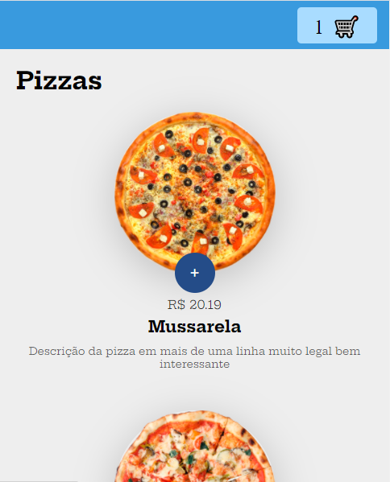

## 💻 Projeto Compras de Pizzas

<h1 align="center">
    
</h1>

### Mobile

  

Projeto realizado no curso javascript da B7web

O objetivo do projeto foi realizar um site de compras de pizzas, onde o foi foram adicionadas varias funções no projeto como clonar a div com javascript, sem precisar repetir várias vezes, manualmente no html.

Assim como colocar os produtos no carrinho e retira-los. Projeto muito importante para meu aprendizado.

## 🛠 Tecnologias

- HTML
- CSS
- JAVASCRIPT
